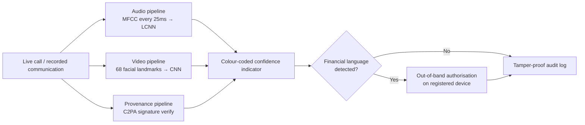

# 🛡️ DeepVerify Pro

### Real-time deepfake detection **+** cryptographic content provenance

*A two-layer defence against live deepfake calls and tampered pre-recorded communications.*

-1f6feb?style=flat-square)

---

## 📑 Table of Contents

- [3.1 What Is DeepVerify Pro?](#31-what-is-deepverify-pro)
- [3.2 Why Combine Ideas 1 and 5?](#32-why-combine-ideas-1-and-5)
- [3.3 Key Features](#33-key-features)
- [ACM Code of Ethics Coverage](#-acm-code-of-ethics-coverage)
- [3.4 How It Works Technically](#34-how-it-works-technically)
- [3.5 Product Impact](#35-product-impact)
- [Risk Analysis](#-risk-analysis)
- [Scalability: Realistic Conditions and Barriers](#-scalability-realistic-conditions-and-barriers)

---

## 3.1 What Is DeepVerify Pro?

DeepVerify Pro is an **enterprise-grade real-time deepfake detection and content authenticity platform** that combines live audio and video synthetic-media detection with cryptographic verification. It addresses the core vulnerability exposed by the Arup incident — the complete absence of any mechanism to verify whether call participants are genuinely human and whether communications originate from trusted sources.

By merging the real-time detection capability of **DeepVerify** with the cryptographic signing infrastructure of **ProvenanceShield**, the combined platform protects organisations against both live deepfake calls and tampered pre-recorded communications simultaneously.

> [!NOTE]
> **Designed for** large enterprises like Arup, financial institutions, law firms, and government agencies where video and voice calls are regularly used to authorise high-value transactions or sensitive decisions.
> **Primary users:** employees in finance, legal, and executive roles — precisely the individuals targeted in the Arup fraud.

Unlike existing tools such as **Pindrop** and **Reality Defender** — which focus exclusively on audio analysis or require post-call review — DeepVerify Pro provides **live multi-modal detection combined with proactive content signing**, creating a two-layer defence that neither solution could achieve alone.

---

## 3.2 Why Combine Ideas 1 and 5?

Each idea on its own had a single, exploitable blind spot:

| System | Limitation when used alone |
| --- | --- |
| **DeepVerify** | Could only detect deepfakes *during a live call*. A pre-recorded deepfake video message or synthetic audio clip would never be analysed in real time. |
| **ProvenanceShield** | Could only verify communications originating from within the organisation's *own signed systems*. External callers impersonating internal staff — as in the Arup case — carry no valid internal signature, making the tool ineffective against the most common attacks. |

**Together they eliminate both weaknesses.** DeepVerify Pro detects synthetic content in real time during live calls, while ProvenanceShield's cryptographic signing layer flags any communication — live or pre-recorded, internal or external — that lacks a verified provenance signature.

> An attacker would need to **simultaneously defeat both** a live neural-network detection engine **and** a cryptographic signing infrastructure — a significantly higher barrier than either system presents alone.

---

## 3.3 Key Features

| # | Feature | ACM Codes |
| --- | --- | --- |
| **F1** | Real-Time Audio Deepfake Detection | `1.2` `1.3` |
| **F2** | Live Video Face Authenticity Verification | `1.3` `1.6` |
| **F3** | Cryptographic Content Provenance Signing | `2.5` `3.7` |
| **F4** | Out-of-Band Financial Authorisation Trigger | `1.2` `2.5` |
| **F5** | Audit Trail & Incident Reporting | `3.1` `3.7` |

### 🎙️ F1 — Real-Time Audio Deepfake Detection &nbsp;`ACM 1.2, 1.3`

DeepVerify Pro analyses every caller's voice continuously throughout a live call, extracting **mel-frequency cepstral coefficients (MFCCs)** — a digital fingerprint of the unique tonal qualities of a human voice — every **25 milliseconds**. These features are compared against patterns known to originate from AI voice-synthesis tools (ElevenLabs, Resemble AI, Tacotron) using a **light convolutional neural network (LCNN)**.

The system displays a live colour-coded confidence indicator visible throughout the call:

| 🟢 Green | 🟡 Amber | 🔴 Red |
| --- | --- | --- |
| Voice verified genuine | Uncertain | Voice likely synthetic |

> **Arup scenario:** the cloned executive's voice would have triggered a red alert within seconds of the call beginning — *before any financial instructions were communicated*.

### 🎥 F2 — Live Video Face Authenticity Verification &nbsp;`ACM 1.3, 1.6`

Simultaneously with audio analysis, DeepVerify Pro analyses each participant's video stream by tracking **68 facial landmark points** — eyes, nose, jawline, and mouth corners. Real human faces exhibit natural micro-movements, irregular blinking, and subtle skin imperfections; AI-generated faces consistently produce detectable artifacts including unnatural smoothness, lighting inconsistencies, and irregular blinking frequency. A convolutional neural network trained on thousands of genuine and synthetic face samples scores each video frame in real time.

> **Arup scenario:** the AI-generated CFO and fabricated colleagues on the video call would have failed this check immediately — synthetic faces cannot replicate the full complexity of natural human facial behaviour.

### 🔏 F3 — Cryptographic Content Provenance Signing &nbsp;`ACM 2.5, 3.7`

Building on ProvenanceShield's **C2PA-based infrastructure**, DeepVerify Pro embeds an invisible cryptographic signature into all video and audio communications produced within the organisation at their point of origin. Any communication received — live call, pre-recorded video message, or audio clip — is automatically checked for a valid provenance signature. Communications lacking a valid signature are immediately flagged as potentially synthetic or tampered, **regardless of whether they come from internal or external sources**.

This extends provenance verification beyond internal communications to flag the *absence* of any trusted signature on incoming content.

> **Arup scenario:** the deepfake call would have carried no valid provenance signature, triggering an automatic alert before any financial discussion occurred.

### 🔐 F4 — Out-of-Band Financial Authorisation Trigger &nbsp;`ACM 1.2, 2.5`

When DeepVerify Pro detects financial language during a call — wire-transfer requests, account numbers, or payment approvals above a defined threshold — it automatically sends a separate verification request to the requester's registered device through an **independent channel completely outside the call environment**. No financial transaction can be processed until this out-of-band confirmation is completed on the requester's separate registered device.

> [!IMPORTANT]
> This trigger fires **regardless of the detection score**. Even if both the audio and video engines fail to flag a sophisticated deepfake, no financial authorisation can be completed on the basis of a single call alone.
>
> **Arup scenario:** this single feature would have broken the fraud chain at the very first of the 15 fraudulent transactions.

### 📜 F5 — Audit Trail & Incident Reporting &nbsp;`ACM 3.1, 3.7`

Every call and communication generates a **timestamped, tamper-proof log** of all detection events, risk scores, provenance checks, and flagged moments. This audit trail serves three purposes:

1. Enables internal security teams to investigate incidents immediately after they occur.
2. Provides law enforcement with forensic evidence of when and how synthetic content was used.
3. Gives insurers the documentation required to process fraud claims.

Anonymised detection data is also used to continuously improve the neural-network models as new deepfake techniques emerge.

> **Arup scenario:** a complete audit trail would have significantly accelerated the Hong Kong police investigation and provided clear forensic evidence for the subsequent legal proceedings.

---

## 🧭 ACM Code of Ethics Coverage

DeepVerify Pro is **centered on solving the ACM ethical obligations** it commits to — every feature maps to specific codes:

| Code | Obligation | Served by |
| --- | --- | --- |
| **1.2** | Avoid harm | F1, F4 |
| **1.3** | Be honest and trustworthy | F1, F2 |
| **1.6** | Respect privacy | F2 |
| **2.5** | Comprehensive evaluation, including analysis of possible risks | F3, F4 |
| **3.1** | Ensure the public good is the central concern | F5 |
| **3.7** | Take special care of systems integrated into societal infrastructure | F3, F5 |

---

## 3.4 How It Works Technically

DeepVerify Pro operates through **three parallel pipelines** running simultaneously during every processed communication.

- **Audio pipeline** — captures the caller's voice and extracts MFCC features every 25 ms, feeding them into an LCNN trained on both human speech and AI-generated voice samples. Outputs a **continuous probability score** that updates the live confidence indicator in real time.
- **Video pipeline** — analyses each incoming video frame with a separate CNN trained to detect facial inconsistencies typical of deepfake generation (unnatural skin texture, irregular blinking, lighting mismatches, micro-expression irregularities), tracking 68 facial landmarks per frame.
- **Provenance pipeline** — operates at the communication-infrastructure level, embedding C2PA-compliant signatures into outgoing communications and verifying incoming ones before they reach the recipient. Runs **independently** of the detection engines, so its protection does not depend on the sophistication of the synthetic content.

All three pipelines run as a lightweight background plugin integrated via the **Zoom and Microsoft Teams developer APIs**.

> [!NOTE]
> **Privacy by architecture.** The entire analysis occurs on the organisation's own servers — **no audio, video, or communication data is transmitted to external third-party servers** — protecting organisational privacy and complying with GDPR, the Australian Privacy Act, and ACM principle 1.6.

Users see only a simple colour-coded indicator throughout the call, requiring no technical knowledge to interpret — accessible to all employees regardless of technical background.

---

## 3.5 Product Impact

The direct benefits of DeepVerify Pro are **not uniform across stakeholders** — they address the specific harms identified in the ERF analysis for each group differently.

- **Finance employees** — the group bearing the greatest personal burden in the Arup incident. DeepVerify Pro removes the impossible burden of detecting sophisticated deepfakes through human judgment alone. The real-time indicator and the financial authorisation trigger mean no single employee can ever again be the sole decision-maker for a multi-million-dollar transfer authorised through a video call. The psychological harm of being deceived while acting in good faith, and the professional consequences that follow, are precisely the harms this system prevents *before* they occur.

- **Impersonated executives** — DeepVerify Pro's cryptographic content provenance signing directly addresses the privacy violation under **ACM 1.6**. Because every legitimate internal communication is signed at its point of origin, any attacker weaponising an executive's face or voice produces content carrying no valid signature. The executive's identity can no longer be harvested and redeployed without leaving a technically detectable trace — restoring a degree of control over one's own professional identity that deepfake technology had effectively eliminated.

- **Arup as an institution** (and organisations like it) — the audit trail and incident reporting feature directly addresses the reputational and legal exposure that follows a fraud event. A timestamped, tamper-proof record significantly reduces the time and cost of post-incident investigation and provides insurers and law enforcement with usable evidence — a gap painfully evident when Hong Kong police investigated the Arup case with no digital forensic trail from the call itself.

- **Arup's clients and business partners** — deployment functions as a credible signal that the organisation has addressed its communication-security vulnerabilities. Clients suffered an indirect harm — diminished confidence in whether communications from Arup could be trusted — that no financial recovery alone could repair.

---

## ⚠️ Risk Analysis

> [!WARNING]
> It would be dishonest to present DeepVerify Pro as a risk-free intervention — it still runs on the power of AI. There are **three considerations** that must be weighed when implementing it.

<strong>1. The automation-complacency risk</strong>

 

As the system becomes embedded in daily workflows, there is a genuine risk that employees treat a green indicator as an **absolute guarantee** of authenticity rather than a **probabilistic assessment**. If the confidence score reads green, employees may stop applying independent judgment — effectively transferring human duties to an automated system that, however accurate, operates within a specific set of training assumptions.

**Mitigation (partial):** the financial authorisation trigger activates regardless of the detection score, ensuring no automated green-light can single-handedly authorise a high-value transaction. We acknowledge this mitigation is *partial*: for non-financial deception scenarios outside the trigger threshold, the overreliance risk remains real and would need complementary employee training the system alone cannot replace.

<strong>2. The adversarial-escalation effect</strong>

 

Deploying a detection tool at scale creates a commercially visible target for adversarial improvement. Criminal organisations that develop deepfake tooling will, over time, specifically test their outputs against the detection signatures systems like DeepVerify Pro rely on. This is not hypothetical — the two-decade arms race between spam filters and spam generators shows how fast adversarial technology can develop.

The audit trail's anonymised aggregation of detection data is designed to accelerate the defensive side of this cycle, but the arms-race dynamic **cannot be eliminated** — only managed, through continuous model retraining and active threat-intelligence sharing, neither of which is guaranteed once the platform is deployed in environments that may deprioritise update cycles.

<strong>3. The false-positive cost</strong>

 

A system that flags genuine calls as potentially synthetic will, at some rate, generate false positives. For time-sensitive contexts — a CFO confirming a legitimate acquisition from an airport lounge on a poor connection — a red alert triggering an out-of-band authorisation requirement may introduce friction that affects real business operations. If false-positive rates are not communicated transparently, organisations may disable detection features to remove friction, **eliminating the protection entirely**. This is a deployment and UX-design challenge as much as a technical one, requiring honest calibration of sensitivity thresholds across different organisational contexts.

---

## 🪜 Scalability: Realistic Conditions and Barriers

DeepVerify Pro's underlying technology is adaptable beyond large-enterprise use, but scaling involves barriers that should not be understated.

> [!CAUTION]
> **Technical barrier** — The on-premise architecture (designed to avoid transmitting audio/video to external servers) requires sufficient local compute to run three parallel neural-network pipelines in real time. Feasible for large enterprises like Arup; a realistic adoption barrier for SMBs or healthcare providers on smaller infrastructure. A cloud-processing alternative would reintroduce the very privacy trade-offs the on-premise design exists to avoid — a tension with no clean solution.

> [!CAUTION]
> **Regulatory barrier** — Extending into government identity verification or legal proceedings requires formal regulatory recognition that cryptographic signatures are admissible evidence of communication authenticity. No such standard currently exists in most jurisdictions, especially AI-based ones. Achieving it would take years of discussion with legal bodies — not impossible, but it demands a detection architecture accurate to whatever sigma level the court requires.

> [!CAUTION]
> **Adoption barrier** — Effectiveness scales directly with the proportion of an organisation's communications routed through the detection infrastructure. If only the finance department deploys it, attackers simply shift targeting elsewhere. Meaningful protection requires **organisation-wide deployment** — executive sponsorship, employee training, and sustained IT change management — precisely the organisational conditions absent in the Arup case when they were needed most.

We acknowledge these projections involve uncertainty. The rate at which detection models keep pace with generation improvements, the regulatory timeline for cybersecurity standards, and organisational willingness to fund mass deployment are all variables that cannot be predicted with confidence.

What **can** be stated with confidence: the specific harms identified in the ERF analysis — an employee deceived through no fault of their own, an executive's identity weaponised without consent, and an organisation exposed to catastrophic financial and privacy loss through a single unverified communication — are directly addressed by this product in ways that none of the existing tools reviewed were designed to address simultaneously.

---

DeepVerify Pro · grounded in the ACM Code of Ethics (1.2 · 1.3 · 1.6 · 2.5 · 3.1 · 3.7)

