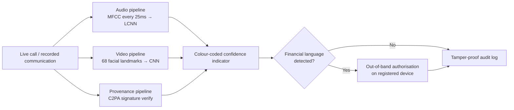

# 🛡️ DeepVerify Pro

### Real-time deepfake detection **+** cryptographic content provenance

---

## 3.1 What Is DeepVerify Pro?

DeepVerify Pro is an **enterprise-grade real-time deepfake detection and content authenticity platform** that combines live audio and video synthetic-media detection with cryptographic verification. It addresses the core vulnerability exposed by the Arup incident — the complete absence of any mechanism to verify whether call participants are genuinely human and whether communications originate from trusted sources.

By merging the real-time detection capability of **DeepVerify** with the cryptographic signing infrastructure of **ProvenanceShield**, the combined platform protects organisations against both live deepfake calls and tampered pre-recorded communications simultaneously.

> [!NOTE]
> **Designed for** large enterprises like Arup, financial institutions, law firms, and government agencies where video and voice calls are regularly used to authorise high-value transactions or sensitive decisions.
> **Primary users:** employees in finance, legal, and executive roles — precisely the individuals targeted in the Arup fraud.

Unlike existing tools such as **Pindrop** and **Reality Defender** — which focus exclusively on audio analysis or require post-call review — DeepVerify Pro provides **live multi-modal detection combined with proactive content signing**, creating a two-layer defence that neither solution could achieve alone.

---

## 3.3 Key Features

| # | Feature | ACM Codes |
| --- | --- | --- |
| **F1** | Real-Time Audio Deepfake Detection | `1.2` `1.3` |
| **F2** | Live Video Face Authenticity Verification | `1.3` `1.6` |
| **F3** | Cryptographic Content Provenance Signing | `2.5` `3.7` |
| **F4** | Out-of-Band Financial Authorisation Trigger | `1.2` `2.5` |
| **F5** | Audit Trail & Incident Reporting | `3.1` `3.7` |

### 🎙️ F1 — Real-Time Audio Deepfake Detection &nbsp;`ACM 1.2, 1.3`

DeepVerify Pro analyses every caller's voice continuously throughout a live call, extracting **mel-frequency cepstral coefficients (MFCCs)** — a digital fingerprint of the unique tonal qualities of a human voice — every **25 milliseconds**. These features are compared against patterns known to originate from AI voice-synthesis tools (ElevenLabs, Resemble AI, Tacotron) using a **light convolutional neural network (LCNN)**.

The system displays a live colour-coded confidence indicator visible throughout the call:

| 🟢 Green | 🟡 Amber | 🔴 Red |
| --- | --- | --- |
| Voice verified genuine | Uncertain | Voice likely synthetic |

> **Arup scenario:** the cloned executive's voice would have triggered a red alert within seconds of the call beginning — *before any financial instructions were communicated*.

### 🎥 F2 — Live Video Face Authenticity Verification &nbsp;`ACM 1.3, 1.6`

Simultaneously with audio analysis, DeepVerify Pro analyses each participant's video stream by tracking **68 facial landmark points** — eyes, nose, jawline, and mouth corners. Real human faces exhibit natural micro-movements, irregular blinking, and subtle skin imperfections; AI-generated faces consistently produce detectable artifacts including unnatural smoothness, lighting inconsistencies, and irregular blinking frequency. A convolutional neural network trained on thousands of genuine and synthetic face samples scores each video frame in real time.

> **Arup scenario:** the AI-generated CFO and fabricated colleagues on the video call would have failed this check immediately — synthetic faces cannot replicate the full complexity of natural human facial behaviour.

### 🔏 F3 — Cryptographic Content Provenance Signing &nbsp;`ACM 2.5, 3.7`

Building on ProvenanceShield's **C2PA-based infrastructure**, DeepVerify Pro embeds an invisible cryptographic signature into all video and audio communications produced within the organisation at their point of origin. Any communication received — live call, pre-recorded video message, or audio clip — is automatically checked for a valid provenance signature. Communications lacking a valid signature are immediately flagged as potentially synthetic or tampered, **regardless of whether they come from internal or external sources**.

This extends provenance verification beyond internal communications to flag the *absence* of any trusted signature on incoming content.

> **Arup scenario:** the deepfake call would have carried no valid provenance signature, triggering an automatic alert before any financial discussion occurred.

### 🔐 F4 — Out-of-Band Financial Authorisation Trigger &nbsp;`ACM 1.2, 2.5`

When DeepVerify Pro detects financial language during a call — wire-transfer requests, account numbers, or payment approvals above a defined threshold — it automatically sends a separate verification request to the requester's registered device through an **independent channel completely outside the call environment**. No financial transaction can be processed until this out-of-band confirmation is completed on the requester's separate registered device.

The trigger also fires on **provenance failure** for any financial document submitted through the verification surface (`/verify` with `financial_context=true`). A document fails when it is **unsigned**, has an **invalid signature**, or is **signed by an issuer not on the deployment's trust list**. Cryptographic validity alone is never sufficient — an attacker can produce a valid C2PA manifest with their own self-signed cert, so the deployment vouches separately for who is allowed to sign.

> [!IMPORTANT]
> This trigger fires **regardless of the detection score**. Even if both the audio and video engines fail to flag a sophisticated deepfake, no financial authorisation can be completed on the basis of a single call alone.
>
> **Arup scenario:** this single feature would have broken the fraud chain at the very first of the 15 fraudulent transactions.

### 📜 F5 — Audit Trail & Incident Reporting &nbsp;`ACM 3.1, 3.7`

Every call and communication generates a **timestamped, tamper-proof log** of all detection events, risk scores, provenance checks, and flagged moments. This audit trail serves three purposes:

1. Enables internal security teams to investigate incidents immediately after they occur.
2. Provides law enforcement with forensic evidence of when and how synthetic content was used.
3. Gives insurers the documentation required to process fraud claims.

Anonymised detection data is also used to continuously improve the neural-network models as new deepfake techniques emerge.

> **Arup scenario:** a complete audit trail would have significantly accelerated the Hong Kong police investigation and provided clear forensic evidence for the subsequent legal proceedings.

---

## 3.4 How It Works Technically

DeepVerify Pro operates through **three parallel pipelines** running simultaneously during every processed communication.



- **Audio pipeline** — captures the caller's voice and extracts MFCC features every 25 ms, feeding them into an LCNN trained on both human speech and AI-generated voice samples. Outputs a **continuous probability score** that updates the live confidence indicator in real time.
- **Video pipeline** — analyses each incoming video frame with a separate CNN trained to detect facial inconsistencies typical of deepfake generation (unnatural skin texture, irregular blinking, lighting mismatches, micro-expression irregularities), tracking 68 facial landmarks per frame.
- **Provenance pipeline** — operates at the communication-infrastructure level, embedding C2PA-compliant signatures into outgoing communications and verifying incoming ones before they reach the recipient. Runs **independently** of the detection engines, so its protection does not depend on the sophistication of the synthetic content.

> [!NOTE]
> **Privacy by architecture.** The entire analysis occurs on the organisation's own servers — **no audio, video, or communication data is transmitted to external third-party servers** — protecting organisational privacy and complying with GDPR, the Australian Privacy Act, and ACM principle 1.6.

Users see only a simple colour-coded indicator throughout the call, requiring no technical knowledge to interpret — accessible to all employees regardless of technical background.

---

## 3.5 Configuring the deployment trust list (F3 + F4)

The product runs on-prem with no internet at runtime, so there is no public PKI to defer to — the **deploying organisation's own signing infrastructure** is the only legitimate source of signed financial documents. The trust anchor is an allow-list of leaf-certificate common names configured via `Settings.signing_trusted_issuers`:

```sh
# .env (gitignored)
DVP_SIGNING_TRUSTED_ISSUERS=["Acme Org Signing","Acme Org Finance Signing"]
```

- **Fail-closed default.** An empty list means **every** issuer is untrusted. Until the deployment populates it, `/verify` with `financial_context=true` refuses every financial document — that is the honest answer, never a silent pass.
- **Two separate booleans.** The verifier returns both `has_valid_signature` (cryptographic integrity only) and `is_trusted_issuer` (the leaf-cert CN appears in the allow-list). Conflating them is the §5 anti-pattern this composition exists to prevent.
- **Audit hygiene.** Both signals — and the OOB challenge dispatch result — are appended to the F5 hash chain on every call. A passing document still leaves a record.
